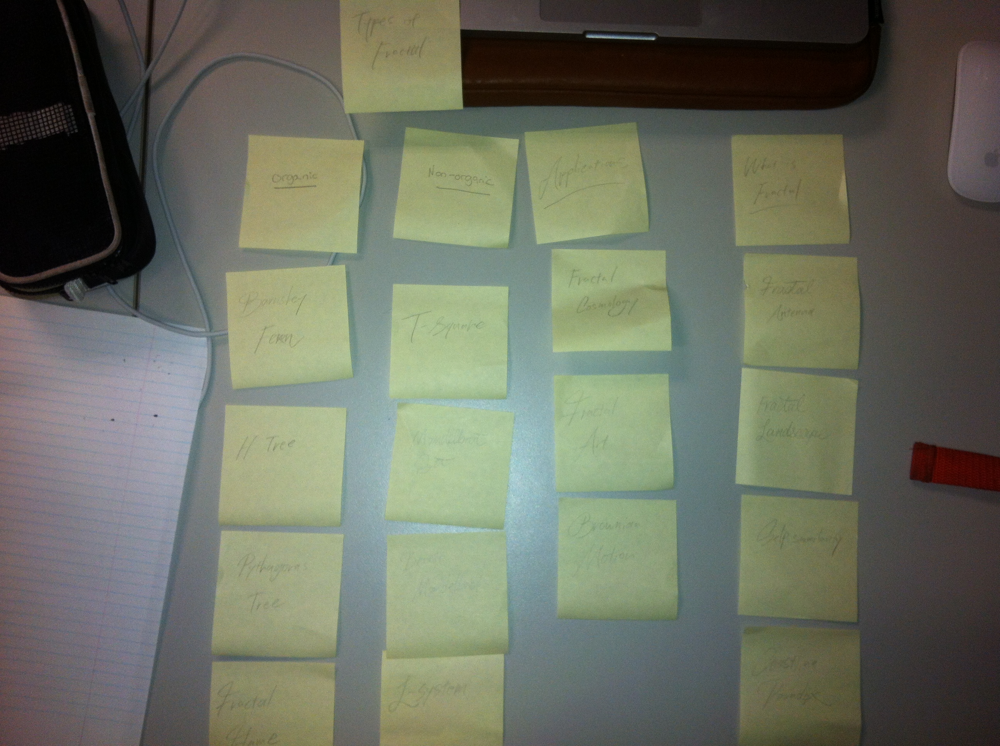
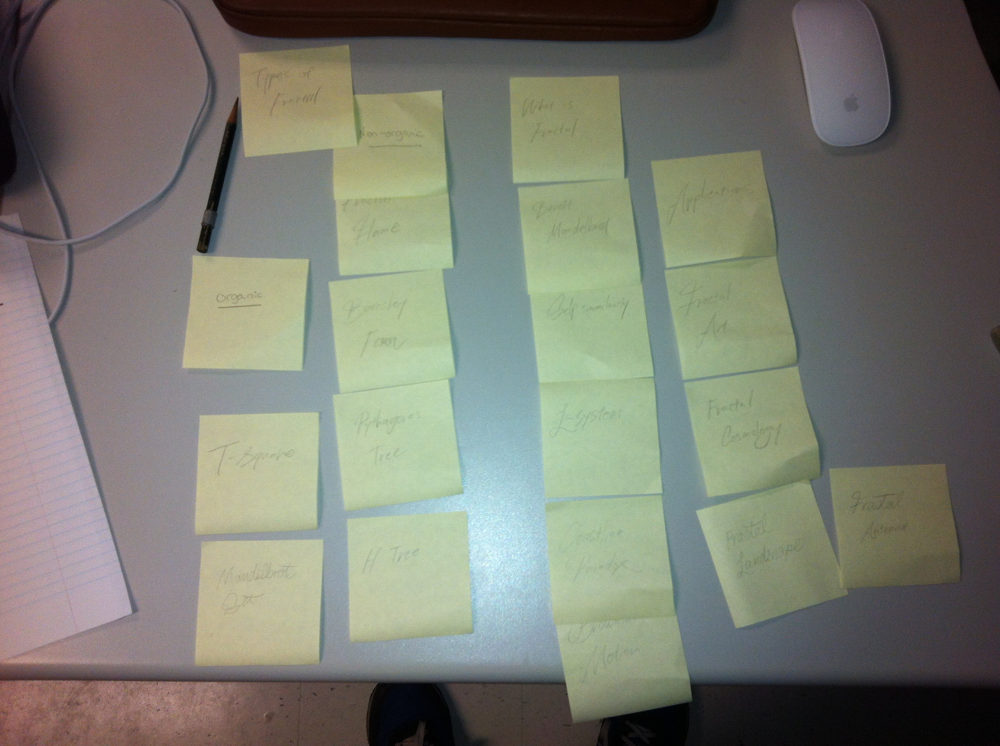

# Card sort report

The purpose of this card sort was to determine common navigation patterns and categories from the content of World of Fractals.

## Specifics

The card sort was conducted by Seita on September 10, 2013 between the times of 8:00 AM and 11:00 AM with the following participants:

- Willam Shaw
- Emily Barklay

### Cards

5 cards were used covering a broad range of applicable content for the website. The following topics were used as cards:

1. Types of Fractal
2. Organic Pattern
3. Non-organic Pattern
4. Applications
5. What is Fractal

## Card sort results

*Card sort 1 by William Shaw

*Card sort 2 by Emily Barklay

## Observations

There was not much questions being asked other than where the article, Fractal Flame
may belong to. William sorted the articles into 3 groups, then Emily later made 2
sub-divisions for Types of Fractals which was a pleasant surprise. They both organized
the cards in the way that's similar to my expectations.
